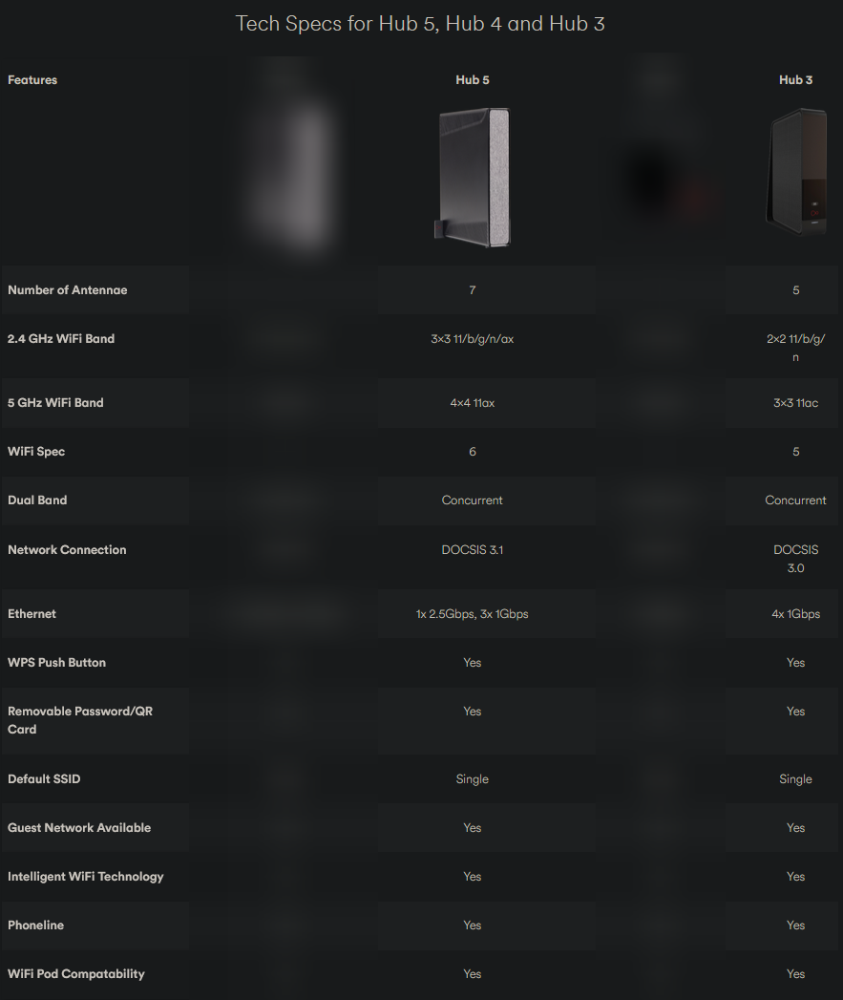

# Vir{m,g}in Media - a tale

Virgin Media (or Virmin Media), one of the world's worst internet service providers I have used so far. Read on to find out my experience with them, and the lengths I have
had to go to in order to get a basic level of support as a long time paying customer.

<!-- more -->

Now that the excerpt is out of the way, let's get into the meat of this post.

If you've ever inspected my IP address in the past... four? years, you'll have noticed that I have been using Virgin Media as my ISP.
Virgin Media are a very widespread internet service provider in the UK, and they offer a variety of services, including broadband, TV, and mobile.
But in this case, I am only a broadband customer. An important note is that I am not on DSL, but in fact, their DOCSIS cable service.

!!! question "What is DOCSIS?"
    From [Wikipedia](https://en.wikipedia.org/wiki/DOCSIS):

    > Data Over Cable Service Interface Specification (DOCSIS) is an international telecommunications standard that permits the addition of high-bandwidth data transfer to an existing cable television (CATV) system. It is used by many cable television operators to provide cable Internet access over their existing hybrid fiber-coaxial (HFC) infrastructure. 

    Basically, this cable service is "Fibre to the cabinet" (FTTC), but instead of your traditional fibre connection going all the way to your house,
    it terminates at the local cabinet, and is copper the rest of the way to your house.
    This technology can still reach gigabit and beyond (up to 10gig down at the time of writing, and 1-2 gigs up), 
    however, your speed, latency, and reliability is all dependent on the range between your house and the cabinet.

## My history as a customer

I have been a customer of Virgin Media for as long as I can remember (which, in this case, is not that long. But it is at least 4 years).
I initially started off with their "M100" package, which was 100mbps down and 10mbps up.
As I live in a household of four members, all of which are heavy internet users, this was not enough, so we ended up upgrading to their M250 package,
which gave us 250mbps down and 20mbps up. This was a much better experience, and we were happy with it for a while.

When we first got our line installed, we were given Virgin Media's ["Super Hub 3"](https://www.techradar.com/reviews/virgin-media-super-hub-3).
This modem/router combo was kitted out with the worst hardware I've ever seen. But, we will get to that later.
All that you need to know is that this modem is **required** - you cannot use your own equipment to connect to the Virgin Media network, as they do not
give you any way to connect to their DOCSIS cable output, let alone authenticate. I'm sure some people have done it, but it isn't something I've
deemed worthy of investigating. Instead, I simply used the admin interface to put the modem into "modem mode", and used a
[TP-Link AX72](https://www.tp-link.com/uk/home-networking/wifi-router/archer-ax72/) as my WiFi router.
The only reason we used a third party WiFi router is because the Super Hub 3's WiFi was so bad that we couldn't even get a signal in the room above it,
and frequently had drop-outs.

## The problems

Problems began a year or two into our M250 contract. We started noticing that our internet was dropping out, and the speeds were not as advertised.
To add to this, Virgin insisted on increasing the price of the contract, despite providing a degraded service.

We called up Virgin's (awful, by the way) support team, and after threatening to leave and explaining why, they offered to upgrade us to the
M500 package for free, and also gave us a discount on the monthly price. This was a good deal, so we took it.
This was welcome as the M500 gave us a 500 megabit download speed (and 50 up), which was double the speed, and we ended up getting it for
roughly the same price as the M250.

**However...**

Not long after we upgraded, we started noticing *even more severe* issues. The internet connection would COMPLETELY drop out at times for up to 5 minutes
at a time. This was especially noticable when multiple people were using the internet at once, and it was very frustrating.
I ended up being kicked out of many games of minecraft and discord calls with my friends several times a day with no clear cause.
I knew this was an issue with Virgin's connection, because I was still able to connect to my home server over the LAN, however could not ping the outside world.

We contacted Virgin media again and explained our issue.

1. The first time, they said there were issues in the area and that they would be fixed soon.
2. They were not fixed soon, so they ran a quick "check", and said that there was nothing wrong.
3. We were hung up on.

I soon realised that we were not going to be getting any sort of help with this issue, so I put my detective hat on and started investigating.

## The investigation

By this point, I had been studying networking for a while, so I knew a few good starting points to look at.
I did a bit of research into tools I could use, and set up a plan to monitor the network for a few days to see if I could find any patterns.

## The plan (& execution)

I would perform the usual troubleshooting. Turn the router off and on again, turn the modem on and off again, etc.
I would do this every now and again, and made sure that these devices were not turned on for more then a week at a time

Then, I set up a few things in the background, running on my server (which is connected via ethernet, which also helped me make sure it wasn't a WiFi issue):

* I set up a [SmokePing](https://fleet.linuxserver.io/image?name=linuxserver/smokeping) docker container, pinging the ISP DNS, router, a few DNS servers, and some other services like Google, Cloudflare, Microsoft Azure, my VPS, a friend's IP, and some other sites.
* I set up [speedtest-tracker](https://fleet.linuxserver.io/image?name=linuxserver/speedtest-tracker) to run a speedtest every 30 minutes and log the results, sending them to discord.
* I set up a [status page](https://status.nexy7574.co.uk) (which is still live and in use) that would also ping back at my house, and log the results.

I also made sure that, whenever I noticed issues starting, I would do the following:

* Run `ping` to the router, and an external site, to see if there were any packet losses or latency spikes.
* Run a speedtest to see if the speed dropped or flatlined
* Check the SmokePing graphs to see if there were any patterns (mostly after an issue)

As you can tell, I took this incredibly seriously. I was not going to let Virgin Media repeatedly screw us over like this, given we were locked into
this contract for so much longer.

## The results

A week or so later, I had some very telling results.

I noticed the following patterns:

* During usage, the latency to WAN would go from 30ms, to 50, 70, 100, 300, 500, 700, 1000, 2000, 3000, 5000, and then timing out.
* Packets would start dropping like crazy after 500 or so milliseconds of latency
* When the pings started timing out, internet connectivity was entirely lost for at least 30 seconds, and up to 5 minutes.
* SmokePing reflected this across *all* graphs. The only thing that didn't reflect this was the ping to the router, which was always stable.
* Speedtest-tracker showed that, leading up to the issue, there would be maybe an hour or so where we were seemingly throttled to half of our
promised speed
* It also showed that for a while after the "crashes", that the speed would stay around 100mbps for maybe a few minutes, before suddenly spiking to
*600* mbps, and then dropping back down to 500.

* The router logged no issues, and the modem was just as error riddled as ever (it usually displays a lot of red herring "errors")
* As a matter of fact, the modem would not respond to pings, or a HTTP request to the WebGUI during the internet issues.

Given all of this information, I *nearly* came to the conclusion that the issue was due to our connection being overloaded, the modem crapping out,
and having to "soft reset" itself. However, I simply couldn't conclude this myself, as the connection still went down even during times of low usage.

## The resolution

In the end, I gave up. I knew there was an issue with my network, but I couldn't reliably pinpoint a specific trigger.

I called up Virgin Media, very disgruntled. I spoke to their live chat agent, flat out refused to do any basic troubleshooting
(I mean, I've done *advanced* troubleshooting. I know they have to ask, but I just wasn't in the mood for it)
and instead stubbornly demanded that they send out an engineer.

After about 30 minutes of being a brick wall, their support team finally agreed to schedule an engineer to come out and take a look at the issue.

The engineer came out, knocked on my door, my dad referred him to me, and I told him about the latency spikes, bandwidth issues, timeouts, and packet loss,
and rather than doing any testing, the engineer went "well you seem like you know your stuff, and I bet I know what the issue is. Let me fetch you an
upgraded hub from my van".

This lovely engineer went out to his van, and came back with a [Super Hub 5](https://www.virginmedia.com/broadband/existing-customer-deals/hub).
You can see how big of an upgrade this was:

Bit of a difference, right? That's because the Hub 5 is for their gigabit service, and is a much more capable device.
It was amazing to receive this device as a replacement, as we aren't even gigabit, and got a huge upgrade.

The Hub 5 is a much more capable device in terms of speed.
I have not used the WiFi on it, because we still have the AX72 (which has more features), but we have not had a single dropout or latency spike since
we got it.

## Conclusion

There are many, many other issues with Virgin Media, which I will detail at a later date (possibly updating this post).
The biggest issue I had here was __not the fact that we had outages__, but that it was so difficult to get support.

We had been a customer for several years, paid them a lot of money, and I had to go to all of this effort just for them to take our issue seriously.

Please, if you are not a Virgin Media customer, and can avoid them, do so. You may think "yeah, but how often do you really need to contact customer service?", and trust me, I think like this too. But when you do need to contact them, you will regret your several year contract.

### TL;DR

Virgin Media upgraded our broadband connection because we were having repeated issues and threatened to leave, but new, even bigger issues arose.
I had to set up an entire lab setup in order to perform the network monitoring they should've been doing, just so that their support team would take my
issue seriously, and send out an engineer. The solution ended up just being to give us a new modem, which should NOT have taken over two months to
sort out.

---

!!! danger "Disclaimer"
    Thoughts, feelings, and experiences described in this blog post are my own and may not reflect everyone's experience.

!!! danger "External links are unaffiliated"
    There are several third party external links on this page, including review pages.
    I have not verified the genuinity or accuracy of these links, and they are provided for reference only.
    I am not affiliated with any of the sites linked, and I do not receive any compensation for linking to them.
